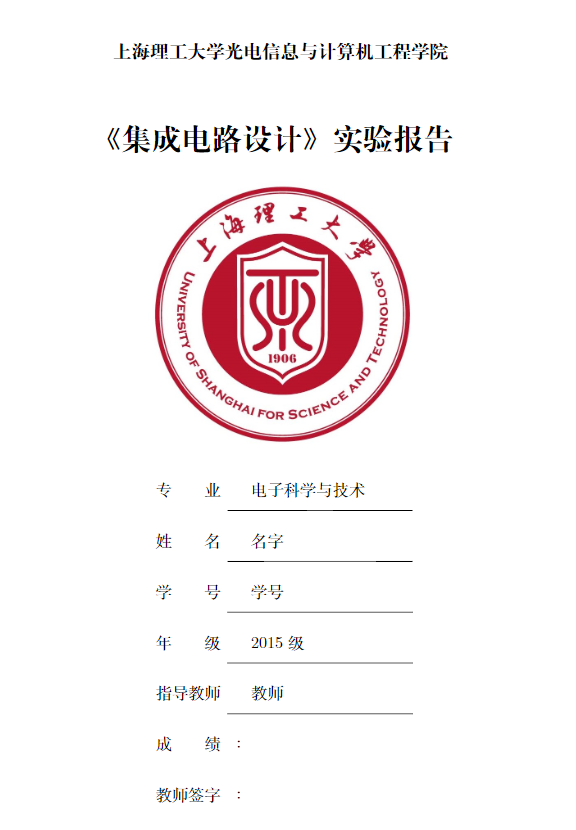
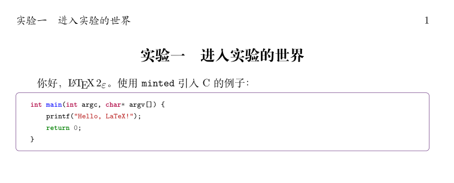

# USST-OECE-ExpReport 
[](https://github.com/FrankSFLYS/USST-OECE-ExpReport) [](LICENSE) []()

This is a LaTeX template for University of Shanghai of Science and Technology, Optical Electronic and Computer Engineering Institute, experimentation reports.

上海理工大学光电信息与计算机工程学院实验报告的 LaTeX 模板。

### 编辑：
一般情况下，无需修改 exp.tex, element/ExpHead.tex。
修改个人信息以及添加文件只需要在 contents.tex 中修改即可。其他可定制信息在 contents.tex 中已以注释方式说明。
建议编辑方式：每个实验使用单独的文件存放（exp/exp1.tex, exp/exp2.tex），在 contents.tex 中以 `\input{exp/exp?}` 的方式连接；文件按分类存放：
```
element - 模板中的固定文件，一般是科目无关的
exp     - 实验报告源文件
figure  - 图片（eps,png,jpg 均可）
listing - 清单（代码）
tabls   - 表格
tikz    - 使用 tikz 绘图的 tex 文件
```

#### 注意
0. exp.tex 为主文件，里面定义了各种样式，如果有特殊需求（比如更改 lstlisting 的样式）可以考虑修改 exp.tex，我也会不定期添加新的
功能在其中。如若修改封面样式，可以在 element/ExpHead.tex 中进行修改。
1. 无需使用 maketitle，如果需要/不需要封面，可以在 contents.tex 中将对应的六行内容解注/注释即可。
2. 由于内容不多，本项目暂未使用 `cls` 和 `sty` 进行样式定义，未来会考虑添加。

### 编译：
在根目录下使用以下指令即可编译。
``` sh
xelatex exp
```
注意当使用 `minted` 宏包插入清单时请添加 `-shell-escape` 选项。
``` sh
xelatex -shell-escape exp
```


### 截图:
封面：

使用 `minted` 引入清单：


